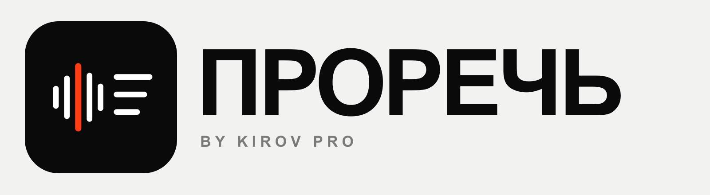
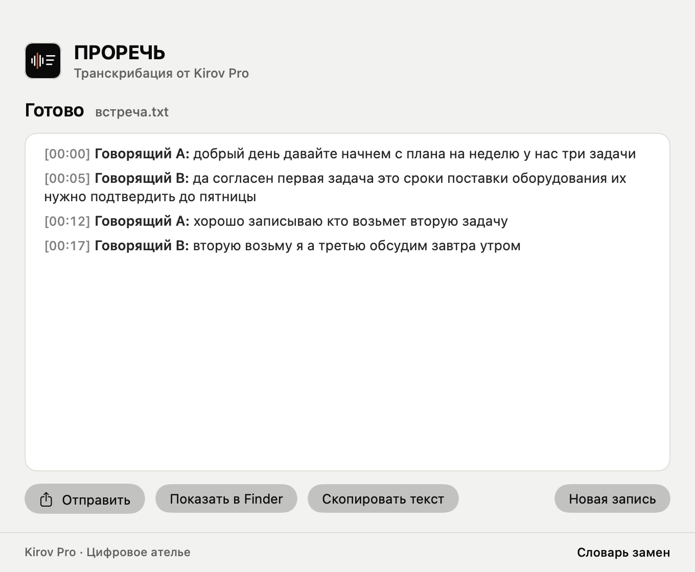
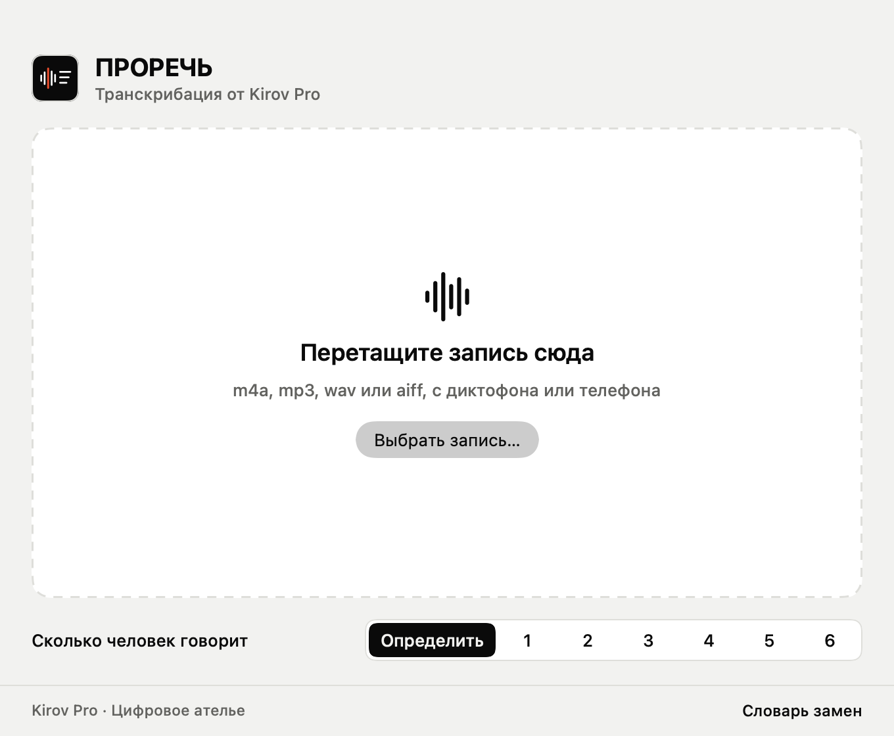
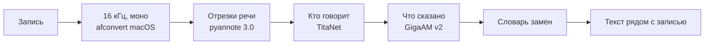

<p align="center"></p>

<p align="center"><b>Транскрибация от Kirov Pro.</b> Русская речь в текст на вашем маке:<br>
без облака, без подписки, после установки без интернета.</p>



Перетащите запись разговора в окно, и рядом с ней появится текст с временем и разметкой,
кто говорит. Кнопка «Отправить» открывает стандартное меню macOS: Сообщения, Почта, AirDrop,
Заметки, Телеграм.

## Установка

Откройте Терминал (Cmd + Пробел, «Терминал»), вставьте команду и нажмите Enter:

```bash
curl -fsSL https://raw.githubusercontent.com/iKapitan/prorech/main/install.sh | bash
```

Команда ставит приложение в «Программы», а Python и модели распознавания кладёт в папку
пользователя `~/Library/Application Support/KirovPro/Prorech`. Всего около 400 МБ,
обычно 5-10 минут. Homebrew и пароль администратора не нужны, системные файлы не меняются.

Разрешение понадобится одно: при первой расшифровке записи из «Загрузок» или с «Рабочего
стола» macOS спросит доступ к этой папке. Нажмите «Разрешить».

Нужен мак на macOS 13 или новее. На Apple Silicon (M1 и новее) работает быстрее всего.

## Как пользоваться



1. Перетащите запись в окно или на значок в Dock. Можно несколько сразу, они пойдут по очереди.
2. Если знаете, сколько человек говорит, выберите число: так голоса разделятся точнее.
3. Когда текст готов, значок в Dock подпрыгнет. Текст лежит рядом с записью:
   `встреча.m4a` даёт `встреча.txt`.

```
[00:00] Говорящий A: добрый день давайте начнем с плана на неделю у нас три задачи
[00:05] Говорящий B: да согласен первая задача это сроки поставки оборудования их нужно подтвердить до пятницы
```

**Словарь замен.** Модель может коверкать названия и жаргон. Ссылка «Словарь замен» внизу
окна открывает файл, куда пишутся строки вида `присейл = пресейл`. Замены применяются
к каждому новому тексту.

## Чего ожидать

- **Скорость.** На маке с чипом M расшифровка занимает около четверти длины записи:
  встреча на 25 минут готова за 6-10 минут.
- **Без пунктуации.** Текст идёт строчными буквами, без точек и запятых. Если нужен
  чистовой вид, его делает любая языковая модель по готовому тексту.
- **Только русский.** Английские слова модель пишет так, как слышит. Их правят
  через словарь замен.
- **Формат.** m4a, mp3, wav и aiff macOS читает сама. Для ogg и opus нужен ffmpeg
  (`brew install ffmpeg`), приложение найдёт его само.

## Как устроено



Окно написано на SwiftUI (`app/`), распознаёт движок на Python (`engine/prorech.py`)
поверх библиотеки [sherpa-onnx](https://github.com/k2-fsa/sherpa-onnx). Движок режет
запись на отрезки речи, группирует их по голосам и распознаёт каждый отрезок кусками
до 25 секунд. Модели скачиваются при установке с релизов sherpa-onnx и проверяются
по контрольной сумме.

Движок можно запускать и без окна:

```bash
~/Library/Application\ Support/KirovPro/Prorech/venv/bin/python \
  "/Applications/ПРОРЕЧЬ.app/Contents/Resources/prorech.py" -n 2 встреча.m4a
```

## Удаление

```bash
curl -fsSL https://raw.githubusercontent.com/iKapitan/prorech/main/uninstall.sh | bash
```

Удаляет приложение, Python и модели. Готовые тексты рядом с записями остаются.

## Сборка из исходников

Нужен Xcode. `bash app/build.sh` собирает `dist/ПРОРЕЧЬ.app` для Apple Silicon и Intel
и архив `dist/Prorech.zip` для релиза.

## Лицензии

Код в этом репозитории распространяется по лицензии MIT. Название и знак ПРОРЕЧЬ
принадлежат Kirov Pro. Модели в репозиторий не входят, они скачиваются при установке
и идут под своими лицензиями:

| Что | Автор | Лицензия |
|---|---|---|
| [GigaAM v2](https://github.com/salute-developers/GigaAM), распознавание речи | Сбер | MIT |
| [pyannote segmentation 3.0](https://huggingface.co/pyannote/segmentation-3.0), отрезки речи | pyannote | MIT |
| TitaNet small, отпечаток голоса | NVIDIA NeMo | CC BY 4.0 |
| [sherpa-onnx](https://github.com/k2-fsa/sherpa-onnx), библиотека запуска | k2-fsa | Apache 2.0 |

---

<p align="center">Kirov Pro · Цифровое ателье</p>
